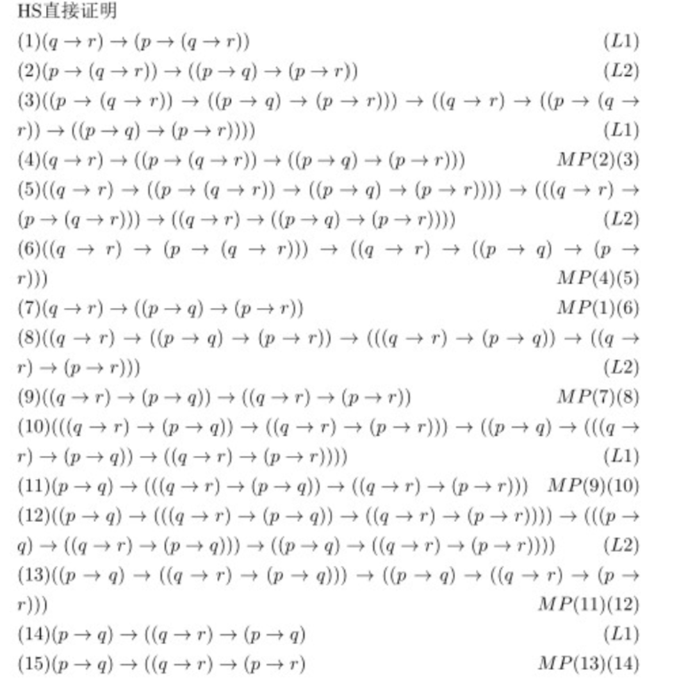

[改写为直接证明的方法](经典命题逻辑公理系统定理证明算法设计_杜国平.pdf)适用于**所有**使用了演绎定理的简化证明

## 三段论
**证明：**$\{p\rightarrow q,q\rightarrow r\}\vdash p\rightarrow r$

|(1)|  $p\rightarrow q$|假定
|:--:|:--|:--|
|(2)|  $q\rightarrow r$|假定
|(3)|  $(q\rightarrow r)\rightarrow(p\rightarrow(q\rightarrow r) )$|L1
|(4)|  $p\rightarrow (q\rightarrow r)$|(2),(3),MP
|(5)|  $(p\rightarrow (q\rightarrow r))\rightarrow((p\rightarrow q)\rightarrow(p\rightarrow r))$|L2
|(6)|  $(p\rightarrow q)\rightarrow(p\rightarrow r)$|(4),(5),MP
|(7)|  $p\rightarrow r$|(1),(6),MP

**证明：**$\vdash (p\rightarrow q)\rightarrow((q\rightarrow r)\rightarrow (p\rightarrow r))$

## 否定肯定律
$(\neg p\rightarrow p)\rightarrow p$

#### 简化证明
**证明：**$\{\neg p\rightarrow p\}\vdash p$

|(1)|  $\neg p\rightarrow(p\rightarrow\neg(\neg p\rightarrow p))$|否定前件律
|:--:|:--|:--|
|(2)|  $(\neg p\rightarrow(p\rightarrow\neg(\neg p\rightarrow p)))\rightarrow((\neg p\rightarrow p)\rightarrow(\neg p \rightarrow \neg(\neg p\rightarrow p)))$|L2
|(3)|  $(\neg p\rightarrow p)\rightarrow(\neg p \rightarrow \neg(\neg p\rightarrow p))$|(1),(2),MP
|(4)|  $\neg p\rightarrow p$|假定
|(5)|  $\neg p \rightarrow \neg(\neg p\rightarrow p)$|(3),(4),MP
|(6)|  $(\neg p \rightarrow \neg(\neg p\rightarrow p))\rightarrow((\neg p\rightarrow p)\rightarrow p)$|L3
|(7)|  $(\neg p\rightarrow p)\rightarrow p$|(5),(6),MP
|(8)|  $p$|(4),(7),MP

#### 直接证明
**证明：**$(\neg p\rightarrow p)\rightarrow p$

待填坑

## 双重否定律

### 双重否定律
$\neg\neg p\rightarrow p$

#### 简化证明
**证明：**$\{\neg\neg p\}\vdash p$
待填坑

#### 直接证明
**证明：**$\neg\neg p\rightarrow p$
待填坑

### 第二双重否定律
$p\rightarrow\neg\neg p$

#### 简化证明
**证明：**$\{\neg\neg\neg p\}\vdash \neg p$
待填坑
#### 直接证明
**证明：**$ p\rightarrow \neg\neg p$
待填坑
